### Mykhailo Doronin — DevOps Engineer

I steer clusters instead of ships — same wheel, different kind of helm ⚓

<h3 align="left">🔗 Connect with me</h3>

## 🧭 About Me

- 🚢 **DevOps Engineer** — I keep clusters, pipelines and infrastructure sailing smoothly
- 🐳 Day to day I work with **Docker & Kubernetes**, provision infra with **Terraform**, and ship changes via **GitOps with ArgoCD**
- 🔁 I build and maintain **CI/CD pipelines** with GitHub Actions / GitLab CI / Jenkins
- ☁️ Comfortable across **AWS** and **on-prem / bare-metal** environments
- 📈 I keep an eye on production with **Prometheus, Grafana**, and the **ELK / Loki** logging stack
- 🌱 Backend roots in **Java, Kotlin & Python** — handy when I need to read the code running on top of my infra
- 💬 Ask me about **Kubernetes, CI/CD, Linux, and infrastructure automation**
- 📫 Reach me at **doroninmykhailo@gmail.com**

## 🛠️ Tech Stack

**Cloud & Infrastructure**

**Containers & Orchestration**

**CI/CD**

**Monitoring & Observability**

**Languages & Data**

## 📊 GitHub Stats

<picture>
  <source media="(prefers-color-scheme: dark)" srcset="https://streak-stats.demolab.com/?user=dormiwww&theme=dark&hide_border=true" />
  <source media="(prefers-color-scheme: light)" srcset="https://streak-stats.demolab.com/?user=dormiwww&theme=default&hide_border=true" />
  
</picture>

## 🐍 My Contributions, Eaten by a Snake

<picture>
  <source media="(prefers-color-scheme: dark)" srcset="https://raw.githubusercontent.com/DorMiwww/DorMiwww/output/github-contribution-grid-snake-dark.svg" />
  <source media="(prefers-color-scheme: light)" srcset="https://raw.githubusercontent.com/DorMiwww/DorMiwww/output/github-contribution-grid-snake.svg" />
  
</picture>

